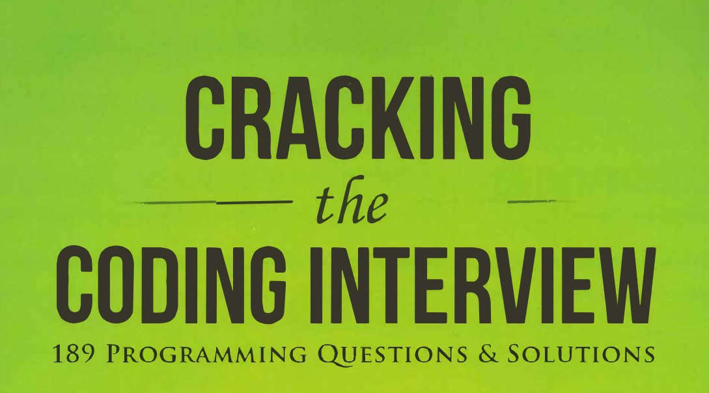

<h1>cracking the coding interview</h1>

solution for book "cracking the coding interview
<h2> Index </h2>
<h2>extra_python</h2> <ul> <li><a href="extra_python/knapsack.py" >knapsack.py</a></li> <li><a href="extra_python/transpose.py" >transpose.py</a></li> <li><a href="extra_python/Euclid.py" >Euclid.py</a></li> <li><a href="extra_python/knp.py" >knp.py</a></li> <li><a href="extra_python/Sieve_of_Eratosthenes.py" >Sieve_of_Eratosthenes.py</a></li> <li><a href="extra_python/sum_of_subset.py" >sum_of_subset.py</a></li> <li><a href="extra_python/kadanes.py" >kadanes.py</a></li></ul> <h2>python --> ch_2_linked_list</h2> <ul> <li><a href="python/ch_2_linked_list/(2.1)Remove_Dups.py" >(2.1)Remove_Dups.py</a></li> <li><a href="python/ch_2_linked_list/(2.5)Sum_List.py" >(2.5)Sum_List.py</a></li> <li><a href="python/ch_2_linked_list/(2.2)Return_Kth_to_Last.py" >(2.2)Return_Kth_to_Last.py</a></li> <li><a href="python/ch_2_linked_list/(2.4)Partition.py" >(2.4)Partition.py</a></li> <li><a href="python/ch_2_linked_list/(2.3)delete_middle_element.py" >(2.3)delete_middle_element.py</a></li></ul> <h2>python --> ch_8_recursion_and_dynaminc_programming</h2> <ul> <li><a href="python/ch_8_recursion_and_dynaminc_programming/(8.13)Stack_of_boxes.py" >(8.13)Stack_of_boxes.py</a></li> <li><a href="python/ch_8_recursion_and_dynaminc_programming/(8.2)Robot_in_a_Grid.py" >(8.2)Robot_in_a_Grid.py</a></li> <li><a href="python/ch_8_recursion_and_dynaminc_programming/(8.1)Triple_step.py" >(8.1)Triple_step.py</a></li> <li><a href="python/ch_8_recursion_and_dynaminc_programming/(8.4)power_set.py" >(8.4)power_set.py</a></li> <li><a href="python/ch_8_recursion_and_dynaminc_programming/(8.6)tower_of_hanoi.py" >(8.6)tower_of_hanoi.py</a></li></ul> <h2>python --> ch_1_array_and_string</h2> <ul> <li><a href="python/ch_1_array_and_string/(1.3)URLify.py" >(1.3)URLify.py</a></li> <li><a href="python/ch_1_array_and_string/(1.1)is_unique.py" >(1.1)is_unique.py</a></li> <li><a href="python/ch_1_array_and_string/(1.4)Palindrome_Permutation.py" >(1.4)Palindrome_Permutation.py</a></li> <li><a href="python/ch_1_array_and_string/(1.7)Rotate_Matrix.py" >(1.7)Rotate_Matrix.py</a></li> <li><a href="python/ch_1_array_and_string/(1.9)String_Rotation.py" >(1.9)String_Rotation.py</a></li> <li><a href="python/ch_1_array_and_string/(1.6)String_Compression.py" >(1.6)String_Compression.py</a></li> <li><a href="python/ch_1_array_and_string/(1.5)One_Away.py" >(1.5)One_Away.py</a></li> <li><a href="python/ch_1_array_and_string/(1.2)Check_Permutation.py" >(1.2)Check_Permutation.py</a></li> <li><a href="python/ch_1_array_and_string/(1.8)Zero_Matrix.py" >(1.8)Zero_Matrix.py</a></li></ul> <h2>python --> ch_16_moderate</h2> <ul> <li><a href="python/ch_16_moderate/(16.2)Word_frequencies.py" >(16.2)Word_frequencies.py</a></li> <li><a href="python/ch_16_moderate/(16.1)Number_swapper.py" >(16.1)Number_swapper.py</a></li> <li><a href="python/ch_16_moderate/(16.3)Intersection.py" >(16.3)Intersection.py</a></li></ul> <h2>dynamic_programming</h2> <ul> <li><a href="dynamic_programming/longestIncreaseSubsequence.py" >longestIncreaseSubsequence.py</a></li> <li><a href="dynamic_programming/knapsack.py" >knapsack.py</a></li> <li><a href="dynamic_programming/TargetSum.py" >TargetSum.py</a></li> <li><a href="dynamic_programming/MinNumberOfCoins.py" >MinNumberOfCoins.py</a></li> <li><a href="dynamic_programming/MinMul.py" >MinMul.py</a></li> <li><a href="dynamic_programming/countSubsetSum.py" >countSubsetSum.py</a></li> <li><a href="dynamic_programming/subsetSum.py" >subsetSum.py</a></li> <li><a href="dynamic_programming/OptimumOperations.py" >OptimumOperations.py</a></li> <li><a href="dynamic_programming/minSubset.py" >minSubset.py</a></li> <li><a href="dynamic_programming/MinNoOfINsertionAndDeletion.py" >MinNoOfINsertionAndDeletion.py</a></li> <li><a href="dynamic_programming/minJump.py" >minJump.py</a></li> <li><a href="dynamic_programming/unboundedKnapsack.py" >unboundedKnapsack.py</a></li> <li><a href="dynamic_programming/fib.py" >fib.py</a></li> <li><a href="dynamic_programming/longestCommonSubstring.py" >longestCommonSubstring.py</a></li> <li><a href="dynamic_programming/lcs.py" >lcs.py</a></li> <li><a href="dynamic_programming/coinChange.py" >coinChange.py</a></li> <li><a href="dynamic_programming/equalSumPartition.py" >equalSumPartition.py</a></li> <li><a href="dynamic_programming/ugly.py" >ugly.py</a></li> <li><a href="dynamic_programming/longestCommonSuperSequence.py" >longestCommonSuperSequence.py</a></li> <li><a href="dynamic_programming/countSubset.py" >countSubset.py</a></li> <li><a href="dynamic_programming/CuttingRod.py" >CuttingRod.py</a></li></ul> 